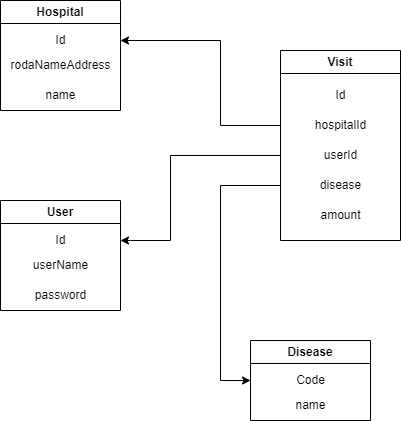

- - -
# About Project

## ▶ Purpose 
> The purpose of this project was created to provide hospital information management and inquiry services nationwide.
- - -
## ▶ Recents
> Project to implement authentication functionality using Jsonwebtoken in Java.
- - -
## ▶ Access address
```shell
{AWS EC2 address}:{port}
```
- - -
## ▶ ERD architecture

- - -
## ▶ Deployment
```shell
sudo sh deploy.sh {db.url} {db.username} {db.password} {jwt.secret} {port} {image.name} {image.version}
```
- - -
## ▶ Endpoint

### ◆ UserJoin
**POST** `/api/v1/users/join`   
**API**
```json
{
  "userName": "String",
  "password": "String",
  "email": "String" 
}
```

### ◆ UserLogin
**POST** `/api/v1/users/login`   
**API**
```json
{
  "userName": "String",
  "password": "String" 
}
```

### ◆ Post Hospital Review
**POST** `/api/v1/hospitals/{id}/reviews`   
**API**
```json
{
  "userName": "String",
  "title": "String",
  "content": "String" 
}
```

### ◆ Inquiry about one Review
**GET** `/api/v1/reviews/{id}`

### ◆ Inquiry about hospital Reviews
**GET** `/api/v1/hospitals/{id}/reviews`

### ◆ Inquiry Hospital with its Reviews
**GET** `/api/v1/hospitals/{id}`
- - -